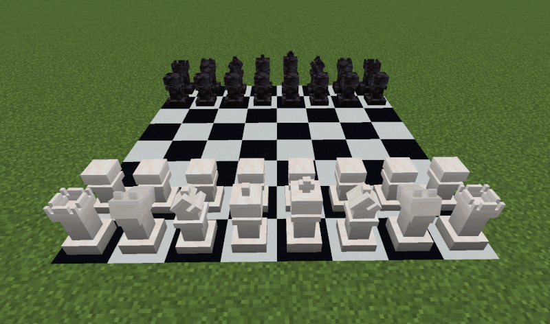
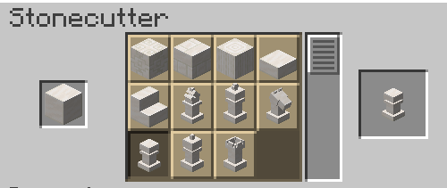
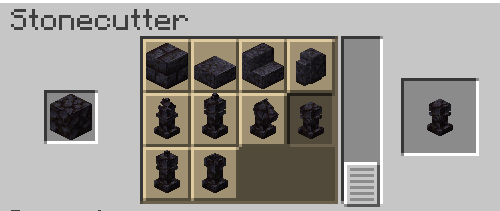

# Chess

This mod adds chess pieces into Minecraft. They are crafted in *Stonecutter*
with *Block of Quartz* and *Blackstone*. And you can grab pieces by right
clicking them with an empty hand.

## Credits

- [NeoForged docs](https://docs.neoforged.net/docs/gettingstarted/)
- [Low-poly Chess pieces by PhantomEye](https://sketchfab.com/3d-models/low-poly-chess-pieces-2ca0f15ebc544be8a22d4d106ac727ab)